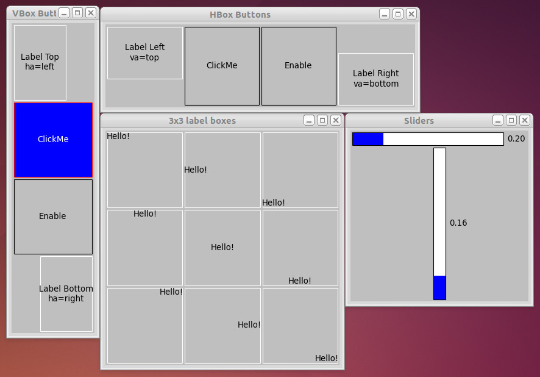
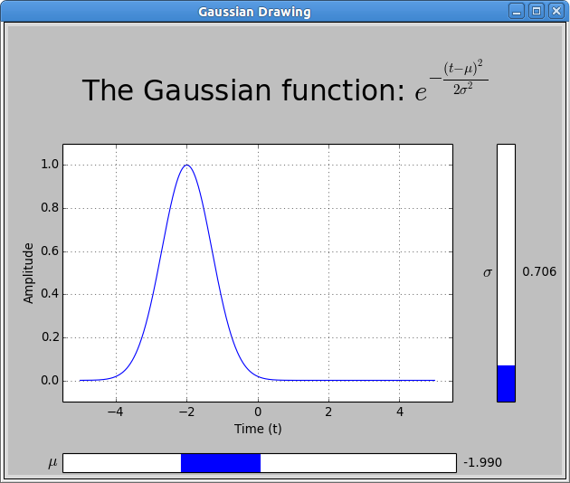

mplkit
======

A GUI toolkit for creating a small set of widgets using Matplotlib.  It mostly
aims at providing widget layout with horizontal and vertical boxes and should
have the same look and feel, as well as API, regardless of the Matplotlib
backend in use.

Widgets
=======

* Button
* Horizontal Box
* Label
* Plot
* Slider
* Vertical Box
* Window

WORK IN PROGRESS!!!

Screenshots
===========

Example 1: Some labels and buttons with horizontal and vertical boxes
---------------------------------------------------------------------

.. code-block:: console

    $ PYTHONPATH=`pwd` python runscripts/example1.py

Example 2: An interactive plot with 2 sliders
---------------------------------------------

.. code-block:: console

    $ PYTHONPATH=`pwd` python runscripts/gaussian_demo.py

