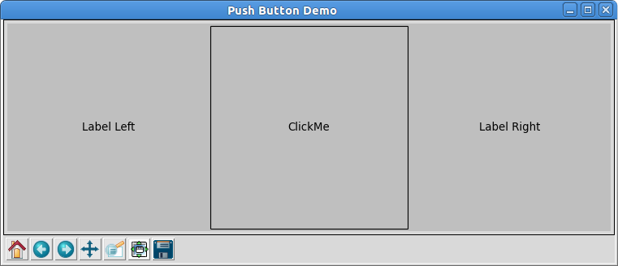

mplkit
======

A gui toolkit for creating a small set of widgets using Matplotlib.

Widgets
=======

* Horizontal Box
* Vertical Box
* Label
* push Button
* Window

WORK IN PROGRESS!!!

Screenshots
===========

Horizontal box with two labels and a push button in the center:

